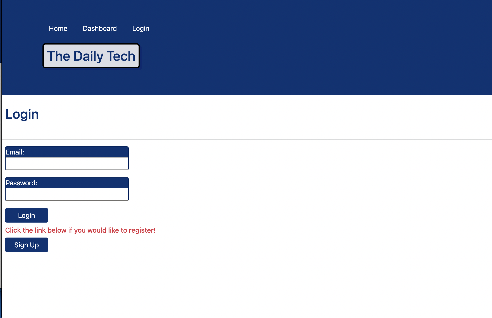
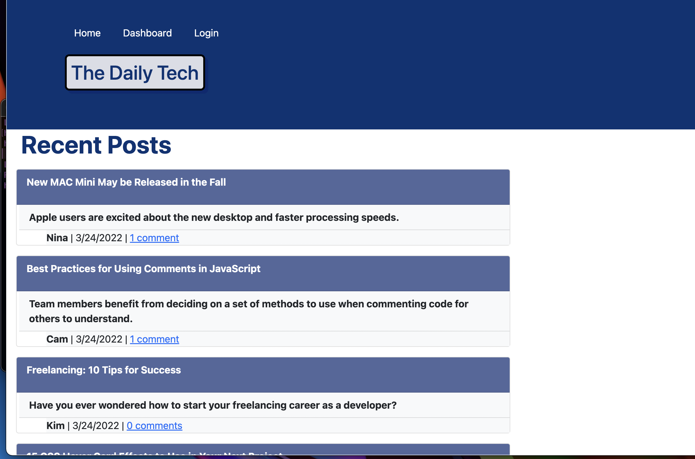
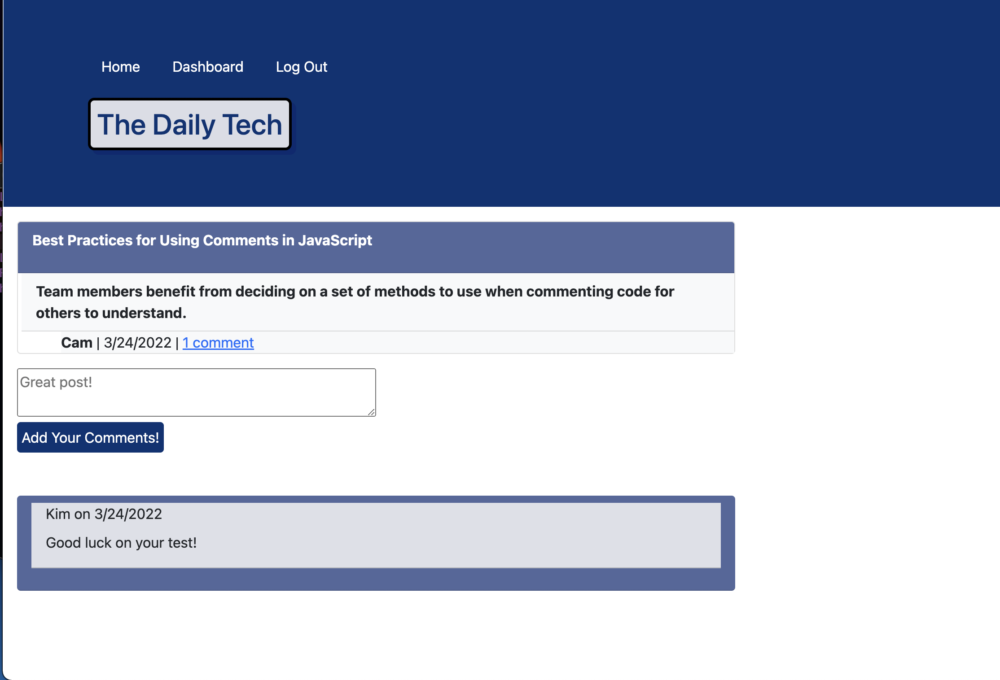

# MVC-Tech-Blog

### Description

This application is a CMS-style blog site similar to a Wordpress site, for developers to post and comment on other posts. The application is structured using the Model View Container (MVC) paradigm, with Handlebars.js as a template engine, Sequelize as the ORM and Express-Session NPM package for authentication.

---

### How to Use:

1. To start this application from the command line, run `npm install`

2. Confirm that the MySQL server is turned on 

3. Run `DROB DATABASE IF EXISTS blog_db;`
And `CREATE DATABASE blog_db;`

4. Return to the terminal and run `node seeds/index.js` to seed database.
5. Run `npm start`
6. Navigate to [http://localhost:3001/](http://localhost:3001/) in your browser

---

---

---

### Technology Used:

- JavaScript
- Node.js
- Express.js
- Express-Session
- Handlebars.js
- MySQL2
- Sequelize
- BCrypt
- Heroku

 ---

#### Author

[Cheribc](https://github.com/cheribc)

[GitHub Repo link:](https://github.com/cheribc/MVC-Tech-Blog)

[Link to deployed app on Heroku](https://daily-tech.herokuapp.com/)

---

#### License

[MIT](LICENSE)